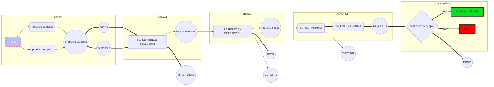

# Source Code

## Workflow



## 0. Requirements

| Package Name           | Version   |
| ---------------------- | --------- |
| requests               | 2.12.5    |
| tensorflow             | <= 1.15.0 |
| pytorch                | 1.4.0     |
| python                 | <= 3.6.0  |
| tqdm                   | 4.44.1    |
| numpy                  | 1.18.1    |
| nltk(punkt, stopwords) | 3.4.5     |
| scikit-learn           | 0.22.1    |
| sparqlwrapper          | 1.8.5     |

### 0.1 Folder Structure

* `./data` all input data and data generated for training
* `./out` generated output data
* `./src` source files

### 0.2 Setup

1. Using `virtualenv`

```shell
sudo apt install virtualenv
sudo apt install gcc
virtualenv venv --python=python3
source venv/bin/activate
deactivate
```

2. Using `Anaconda` (Mac install from [Anaconda](https://www.anaconda.com/distribution/) version python3.7)

```shell
conda create venv python=3.6
conda config --add channels conda-forge 
conda activate venv
conda install all_the_libs_you_need
conda deactivate
```

## 1. Prepare train/test data

### 1.1 General:

```shell
mkdir ./data
mkdir ./data/relations
mkdir ./data/labels
mkdir ./data/wiki
mkdir ./data/predictions
mkdir ./data/splits
mkdir ./data/splits/known
mkdir ./data/splits/zero_shot
mkdir ./data/train/
mkdir ./data/train/known
```

* Put all relations into ./data/relations
* Put all labels into ./data/labels


If you want to skip the preprocessing steps download the data from [here](https://mgtvgsgb.livedrive.com/item/592f2ecf50a542809caddfbceb9d6e3e)

### 1.2 Preparing work

```python
# Download Wikipedia Articles
mkdir ./data/wiki
python src/download_wikipedia.py ./data/relations ./data/wiki

''' 
	zero_shot should be the files you want to predict => with no answers
	known should be the trainning dataset
'''
# Create known and zero_shot split
python src/split_data.py \
    --input_path=./data/relations \
    --wiki_path=./data/wiki \
    --save_path=./data/splits \
    --ratio=0.9 
  
'''
	Only the consider the sentences with tail => for train_squad.py
'''
# Generate training data for the bert model
python src/generate_training_data.py \
    --input_path=./data/splits/known \
    --wiki_path=./data/wiki \
    --save_path=./data/train/known \
    --labels_path=./data/labels \
    --data_type='train'
    
# Generate negative samples for the bert model
python generate_negative_sample.py
```


## 2. Fine-tune the model [known]

```shell
# Get threshold for bert 
python run_squad.py \
  --vocab_file=./vocab.txt \
  --bert_config_file=./bert_config.json \
  --init_checkpoint=./model.ckpt-21719 \
  --do_predict=True \
  --predict_file=./dev-v2.0.json \
  --learning_rate=3e-5 \
  --max_seq_length=384 \
  --doc_stride=128 \
  --output_dir=/tmp/squad2.0_base/ \
  --do_lower_case=False \
  --version_2_with_negative=True \
 
python evaluate-v2.0.py  dev-v2.0.json predictions.json --na-prob-file null_odds.json
```

`CUDA_VISIBLE_DEVICE=0` if you have one or zero GPU on your machine(0 refers to the index )

### 2.1 Train the BERT model over the training data [Should run generate_training_data beforehand]

```shell
CUDA_VISIBLE_DEVICES=0 python src/train_bert/run_squad.py  \
	--vocab_file=./base_model/vocab.txt \
	--bert_config_file=./base_model/bert_config.json \
	--init_checkpoint=./base_model/model.ckpt-21719 \
	--do_train=True \
	--train_file=./data/train/known/known_relations_train.json \
	--do_predict=False \
	--train_batch_size=6 \
	--learning_rate=3e-5 \
	--num_train_epochs=2.0 \
	--max_seq_length=128 \
	--doc_stride=128 \
	--output_dir=./data/model \
	--do_lower_case=False \
	--version_2_with_negative=True \
	--null_score_diff_threshold=-1.891298770904541 => Pick the right value
```

### 2.2  Sentence retriever + relation extraction [P1+P2]

```shell
# prepare data for ranker-net
CUDA_VISIBLE_DEVICES=0 python src/relation_extraction.py \
	--feat_path=out/features/trainonknown/known \
	--split=known \
	--wiki_data=./data/wiki \
	--vocab_file=./base_model/vocab.txt \
	--bert_config_file=./base_model/bert_config.json \
	--init_checkpoint=./data/model \
	--output_dir=/tmp/tmp1 \
	--do_predict=True \
	--do_train=False \
	--predict_file=./ \
	--k_sentences=20 \
	--predict_batch_size=32 \
	--do_lower_case=False \
	--num-kw-queries=5 \
	--out_name=kw_sent \
	--version_2_with_negative=True \
	--null_score_diff_threshold=-1.8903636932373047 => Pick the right value
```

### 2.3 Re-ranking [P3]

```shell
python train_ranker.py \
	--name=kw_sent \
	--experiment=trainonknown \
	--val_type=known

# --phase='known' => default condition
# --type='pos' => default condition
python filter_before_rankerNet.py 
# <=> python filter_before_rankerNet.py --type='pos' --phase='known'
python filter_before_rankerNet.py --type='neg'

python filter_after_rankerNet.py

'''
	This part need GUI, cannot run over GPU cluster
'''
# Draw cutoff graph after BERT
python draw_graph.py --graph_type=before
# Draw cutoff graph after RankerNet
python draw_graph.py --graph_type=after
```

 ### 2.4 Validation negative samples

```shell
# [update 15/05/2020] => make sure you pull.
# Need run latest generate_negative_samples.py beforehand. => !Important
CUDA_VISIBLE_DEVICES=0,1,2,3 python src/relation_extraction.py \
	--feat_path=out/features/trainonknown/known \
	--split=neg \
	--wiki_data=./data/wiki \
	--vocab_file=/home/guo/bert/vocab.txt \
	--bert_config_file=/home/guo/bert/bert_config.json \
	--init_checkpoint=/home/guo/trainonall \
	-output_dir=/tmp/tmp1 \
	--do_predict=True \
	--do_train=False \
	--predict_file=./ \
	--k_sentences=20 \
	--do_lower_case=False \
	--predict_batch_size=32 \
	--num-kw-queries=5 \
	--out_name=kw_sent \
	--version_2_with_negative=True \
	--null_score_diff_threshold=-1.8903636932373047 => Pick the right value
```

## 3. Fine-tune the model [zero_shot]

### 3.1 Relation extraction

```shell
# Skip run_squad.py part
# Make sure the wikipedia articles were downloaded for zero_shot part.
CUDA_VISIBLE_DEVICES=0,1,2,3 python src/relation_extraction.py \
	--feat_path=out/features/trainonknown/zero_shot \
	--split=zero_shot \
	--wiki_data=./data/wiki \
	--vocab_file=/home/gk06997s/base_model/vocab.txt \
  	--bert_config_file=/home/gk06997s/base_model/bert_config.json \
  	--init_checkpoint=/home/gk06997s/base_model/squad_base \
	--output_dir=/tmp/tmp1 \
	--do_predict=True \
	--do_train=False \
	--predict_file=./ \
	--k_sentences=20 \
	--predict_batch_size=32 \
	--num-kw-queries=5 \
	--out_name=kw_sent \
	--do_lower_case=False \
	--version_2_with_negative=True \
	--null_score_diff_threshold=-1.891298770904541 => Pick the right value
```

### 3.2 Generate negative samples

```shell
python generate_negative_samples.py --relation_dir=./data/splits/zero_shot
# Could run the script like this to save time.
For the if __name__ = '__main__':
label_ds()
#    main()
#    generate_validation_set_4negative()
zero_shot_generate_articles_4negative()
```

### 3.3 Relation extraction on the negative samples

```shell
CUDA_VISIBLE_DEVICES=0,1,2,3 python src/relation_extraction.py \
	--feat_path=out/features/trainonknown/zero_shot \
	--split=neg \
	--wiki_data=./data/wiki \
	--vocab_file=./base_model/vocab.txt \
	--bert_config_file=./base_model/bert_config.json \
	--init_checkpoint=./data/model \
	--output_dir=/tmp/tmp1 \
	--do_predict=True \
	--do_train=False \
	--predict_file=./ \
	--k_sentences=20 \
	--predict_batch_size=32 \
	--num-kw-queries=5 \
	--out_name=kw_sent \
	--do_lower_case=False \
	--version_2_with_negative=True \
	--null_score_diff_threshold=-1.8903636932373047 => Pick the right value
```

```shell
# Evaluation on results
python filter_before_rankerNet.py --type='pos' --phase='zero_shot'
python filter_before_rankerNet.py --type='neg' --phase='zero_shot'
```

## 4. Prediction phase

### 4.1 Predict by relations

```shell
# should put all the PXXX_test.json to the ./data/splits/zero_shot
CUDA_VISIBLE_DEVICES=0 python src/relation_extraction.py \
	--feat_path=out/features/trainonknown/zero_shot \
	--split=zero_shot \
	--wiki_data=./data/wiki \
	--vocab_file=/home/guo/bert/vocab.txt \
	--bert_config_file=/home/guo/bert/bert_config.json \
	--init_checkpoint=/home/guo/trainonall \
	--output_dir=/tmp/tmp1 \
	--do_predict=True \
	--do_train=False \
	--predict_file=./ \
	--k_sentences=20 \
	--predict_batch_size=32 \
	--num-kw-queries=5 \
	--out_name=kw_sent \
	--version_2_with_negative=True \
	--null_score_diff_threshold=-1.8903636932373047 => Pick the right value
```

### 4.2 Predict by class

### 4.3 Predict by article

### 5. Iterative training

** !!!! Must put the initial model/bert_config_file .json/vocab .txt in the /kbCompletion-tmp/iterations/model_start_ckt**

```shell
mkdir iterations[TOCHANGE]
mkdir iterations[TOCHANGE]/model_start_ckt
mkdir iterations[TOCHANGE]/data
cp ./data/splits/zero_shot/*_test.json ./iterations[TOCHANGE]/data

python iterative_training.py --num_iter=5 --top_N=10 --num_GPUs=1 --threshold=0.0 --random=True --output_iter=./iterations
```

### 5.1 F1-score
python f1_score.py \
    --model_path=/home/gk06997s/base_model/squad_base \
    --vocab_file=/home/gk06997s/base_model/vocab.txt \
    --config_file=/home/gk06997s/base_model/bert_config.json

### 6. Problems encountered

#### 6.1 UnicodeError

```shell
export LANGUAGE=en_US.UTF-8
export LC_ALL=en_US.UTF-8
export LANG=en_US.UTF-8
export LC_TYPE=en_US.UTF-8
```

