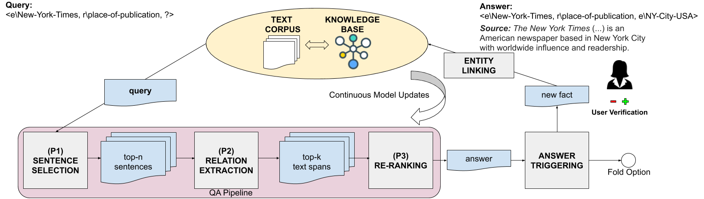

# IntKB: A Verifiable Interactive Framework for Knowledge Base Completion
This is the PyTorch implementation of the COLING 2020 paper [IntKB: A Verifiable Interactive Framework for Knowledge Base Completion](Paper/IntKB_Paper.pdf)


## Live Demo

We are currently running our system in a live demo: [https://wikidatacomplete.org/](https://wikidatacomplete.org/)

## IntKB

<p align="center"></p>

Knowledge bases (KBs) are essential for many downstream NLP tasks, yet their prime shortcoming is that they are often incomplete. State-of-the-art frameworks for KB completion often lack sufficient accuracy to work fully automated without human supervision. As a remedy, we propose IntKB: a novel interactive framework for KB completion from text based on a question answering pipeline. Our framework is tailored to the specific needs of a human-in-the-loop paradigm: (i) We generate facts that are aligned with text snippets and are thus immediately verifiable by humans. (ii) Our system is designed such that it continuously learns during the KB completion task and, therefore, significantly improves its performance upon initial zero- and few-shot relations over time. (iii) We only trigger human interactions when there is enough information for a correct prediction. Therefore, we train our system with negative examples and a fold-option if there is no answer. Our framework yields a favorable performance: it achieves a hit@1 ratio of 26.3% for initially unseen relations, upon which it gradually improves to 45.7%.

## Source Code

You can find the source code used for the research paper [here](src/README.md). Please understand that we lack time and resources to maintain this repository but check out our [live demo](https://wikidatacomplete.org/).

## Open Review

We want to support an open discourse about science and decided to publish our COLING 2020 [reviews](Reviews/README.md).

## Citation

Please cite this paper if you use find our work useful

```
@inproceedings{intkb2020,
  title={IntKB: A Verifiable Interactive Framework for Knowledge Base Completion},
  author={Kratzwald, Bernhard and Kunpeng, Guo and Feuerriegel, Stefan and Diefenbach, Dennis},
  booktitle={International Conference on Computational Linguistics (COLING)},
  year={2020}
}
```

## Contact

Any questions left?

Please write an email to `bkratzwald [AET] ethz [DOT] ch`